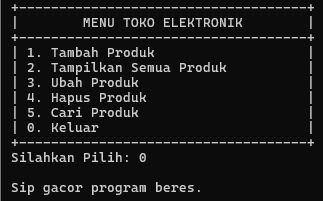
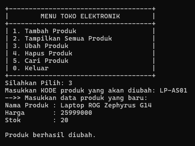
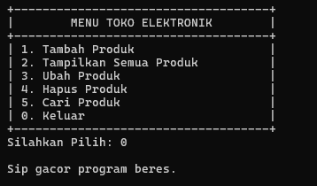
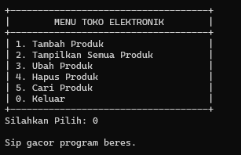
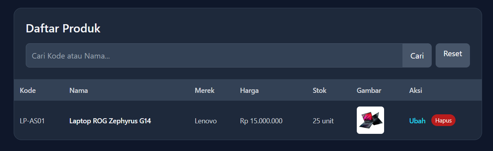
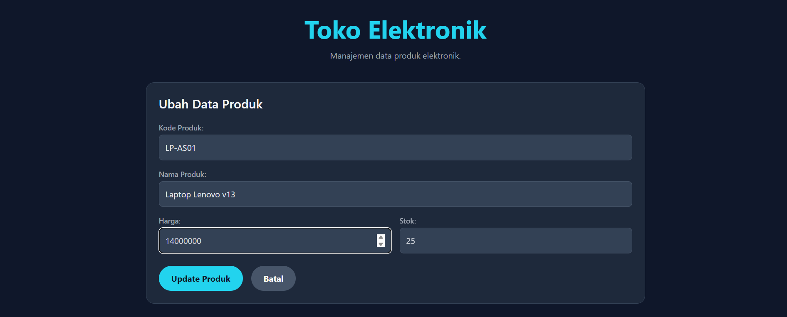

# Tugas Praktikum 1 - Desain Pemrograman Berorientasi Objek (TP1DPBO2425C1)

Saya **Mochamamd Azka Basria** dengan NIM **2405170** mengerjakan Tugas Praktikum 1 dalam mata kuliah Desain Pemrograman Berorientasi Objek untuk keberkahan-Nya maka saya tidak akan melakukan kecurangan seperti yang telah dispesifikasikan. Aamiin.

_Repository_ ini merupakan implementasi konsep OOP (_Object-Oriented Programming_) dalam 4 bahasa: **C++**, **Java**, **Python**, dan **PHP** dengan studi kasus Toko Elektronik. Program ini mendemonstrasikan penggunaan _class_ sederhana dengan atribut, _constructor_, _getter/setter_, serta fitur dasar CRUD (_Create, Read, Update, Delete_) dan pencarian data.

---

## Fitur Utama

### **C++ / Java / Python (Aplikasi Konsol / CLI)**

- **Tambah Data:** Menambahkan data produk elektronik baru.
- **Tampilkan Data:** Menampilkan semua data produk yang tersimpan.
- **Update Data:** Mengubah data produk berdasarkan **Kode Produk**.
- **Hapus Data:** Menghapus data produk berdasarkan **Kode Produk**.
- **Cari Data:** Mencari dan menampilkan detail data produk berdasarkan **Kode Produk**.

### **PHP (Aplikasi Web)**

- **Tambah Data:** Menambahkan data produk baru melalui form HTML.
- **Tampilkan Data:** Menampilkan semua produk dalam sebuah tabel yang interaktif.
- **Update & Hapus Data:** Mengubah dan menghapus data langsung dari tabel.
- **Penyimpanan Gambar:** Menyimpan _path_ gambar untuk ditampilkan di tabel.
- **Pencarian Dinamis:** Mencari produk berdasarkan **Kode Produk** atau **Nama Produk** tanpa me-_reload_ halaman.
- **Penyimpanan Berbasis Session:** Mengelola data tanpa database, data akan tersimpan selama sesi browser aktif.

---

## 🛠 Konsep OOP yang Digunakan

- **Class & Object:** Menggunakan `class BarangElektronik` sebagai _blueprint_ dan membuat _object_ untuk setiap produk.
- **Constructor:** Menginisialisasi _object_ `BarangElektronik` dengan data awal.
- **Enkapsulasi:** Melindungi data dengan atribut _private_ dan menyediakan akses terkontrol melalui metode _public_ `getter` dan `setter`.
- **Array / List of Objects:** Menggunakan struktur data seperti `list` (C++ & Python), `ArrayList` (Java), dan `array` (PHP) sebagai wadah penyimpanan objek produk di memori.

---

## 📂 Struktur Proyek

```
.
├── CPP/
│   ├── BarangElektronik.cpp
│   └── main.cpp
├── JAVA/
│   ├── BarangElektronik.java
│   └── Main.java
├── PYTHON/
│   ├── BarangElektronik.py
│   └── main.py
├── PHP/
|   ├── images/
│   ├── BarangElektronik.php
│   └── index.php
└── README.md
```

---

## 📌 Desain dan Alur Kerja

### **Desain Class (`BarangElektronik`)**

- **Atribut:**
  - `kodeProduk` (string) → Identifier unik untuk setiap produk.
  - `namaProduk` (string)
  - `merekProduk` (string)
  - `hargaProduk` (int)
  - `stokProduk` (int)
  - `kategoriProduk` (string)
  - `gambar` (string) → Khusus untuk versi PHP.
- **Method:** _Constructor_, _getters_ untuk semua atribut, dan _setters_ untuk atribut yang dapat diubah (`nama`, `harga`, `stok`).

### **Alur Kerja Aplikasi**

1.  **Inisialisasi:** Program dimulai, dan untuk versi C++/Java/Python, beberapa data _dummy_ dimuat ke dalam list. Untuk PHP, program memulai _session_ dan menyiapkan array `$_SESSION['gudang']`.
2.  **Tampilan Menu/UI:**
    - **CLI:** Menu berbasis teks ditampilkan di terminal, meminta input angka dari pengguna.
    - **Web:** Halaman web dengan form input dan tabel data ditampilkan di browser.
3.  **Aksi Pengguna:**
    - **Tambah:** Pengguna memasukkan data baru. Sebuah _object_ `BarangElektronik` baru dibuat dan disimpan ke dalam list/array.
    - **Tampilkan:** Program melakukan iterasi pada list/array dan mencetak detail setiap _object_.
    - **Update:** Program mencari _object_ berdasarkan `kodeProduk`, kemudian memanggil metode _setter_ untuk memperbarui datanya.
    - **Hapus:** Program mencari _object_ berdasarkan `kodeProduk` dan menghapusnya dari list/array.
    - **Cari:** Program mencari _object_ berdasarkan `kodeProduk` dan menampilkan detailnya jika ditemukan.
4.  **Loop/Siklus Hidup:**
    - **CLI:** Program terus menampilkan menu hingga pengguna memilih opsi **0 (Keluar)**.
    - **Web:** Program memproses setiap permintaan (tambah, edit, hapus) dan me-_render_ ulang halaman dengan data terbaru yang disimpan di _session_.

Tentu, ini format Markdown yang rapi untuk dokumentasi program C++ Anda.

# Dokumentasi Program C++

Berikut adalah dokumentasi visual untuk setiap fungsi utama dalam aplikasi konsol C++.

---

### Fungsi Tambah Produk (ADD)

## 

### Fungsi Tampilkan Produk (SHOW)

## 

### Fungsi Ubah Produk (UPDATE)

## 

### Fungsi Hapus Produk (DELETE)

## 

### Fungsi Cari Produk (FIND)

## 

### Fungsi Keluar (EXIT)

## 

# Dokumentasi Program Java

Berikut adalah dokumentasi visual untuk setiap fungsi utama dalam aplikasi konsol Java.

---

### Fungsi Tambah Produk (ADD)

## 

### Fungsi Tampilkan Produk (SHOW)

## 

### Fungsi Ubah Produk (UPDATE)

## 

### Fungsi Hapus Produk (DELETE)

## 

### Fungsi Cari Produk (FIND)

## 

### Fungsi Keluar (EXIT)

## 

# Dokumentasi Program Python

Berikut adalah dokumentasi visual untuk setiap fungsi utama dalam aplikasi konsol Python.

---

### Fungsi Tambah Produk (ADD)

## 

### Fungsi Tampilkan Produk (SHOW)

## 

### Fungsi Ubah Produk (UPDATE)

## 

### Fungsi Hapus Produk (DELETE)

## 

### Fungsi Cari Produk (FIND)

## 

### Fungsi Keluar (EXIT)

## 

# Dokumentasi Program PHP

Berikut adalah dokumentasi visual untuk setiap fungsi utama dalam Website menggunakan PHP.

---

### Fungsi Tambah Produk (ADD)

## 

## 

### Fungsi Ubah Produk (UPDATE)

## 

### Fungsi Hapus Produk (DELETE)

## 

### Fungsi Cari Produk (FIND)

## 
